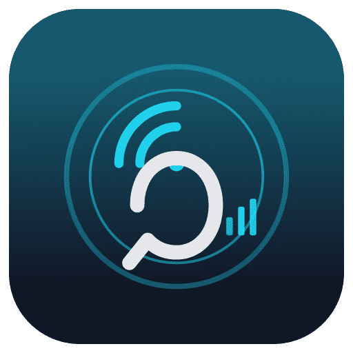
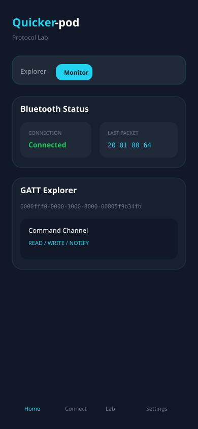

  

<h1 align="center">Quicker-pod</h1>

  <strong>Free &amp; open-source Tripper Pod companion</strong> 
  Connect over BLE, explore the protocol, and monitor live traffic — no account, no fees, no app store.

  <a href="https://praneth2580.github.io/Quicker-pod/"><strong>Live demo</strong></a>
  ·
  <a href="https://praneth2580.github.io/Quicker-pod/dashboard">Open dashboard</a>
  ·
  <a href="https://github.com/praneth2580/Quicker-pod">GitHub</a>

  

> **Install the PWA for the full app experience.** Add Quicker-pod to your home screen (Android Chrome or iOS Safari). Once installed, the app opens the **dashboard** directly — no marketing landing page — so you can connect and test faster on the bike.

**Quicker-pod** is an open-source, mobile-first Progressive Web App for exploring and communicating with the Royal Enfield **Tripper Pod** over Bluetooth Low Energy (BLE).

It is a community-driven alternative to the official Tripper Pod app. Version 1 focuses on **protocol exploration and BLE diagnostics** — not turn-by-turn navigation. The goal is to reverse-engineer the Tripper Pod communication protocol and build a fully open replacement over time.

For setup, development, build, and deployment instructions, see **[DEVELOPMENT.md](./DEVELOPMENT.md)**.

---

## What you can do

| Area | What it does |
|------|----------------|
| **Dashboard** | See Bluetooth status, connection state, device info, and your last sent/received packets |
| **Connect** | Scan for BLE devices, filter results, connect, and disconnect |
| **Protocol Lab** | Full BLE workbench — explore GATT, monitor live device traffic, send packets, run mutations, export sessions |
| **Settings** | Toggle dark mode, debug mode, and experimental features |

Install the app on your phone (PWA) for a standalone experience optimized for on-bike protocol testing with Android Chrome. **Installed users skip the landing page and land on the dashboard** (`/dashboard`) automatically.

---

## How to use Quicker-pod

### 1. Connect your Tripper

1. Open **Connect** (`/connect`)
2. Tap **Connect** and select your device (`RE_DISP` or `RE_*`) in the Chrome BLE picker
3. Enter the **6-digit PIN** shown on your Tripper display
4. Confirm connection on the **Dashboard**

Requires Chrome on Android or desktop with Web Bluetooth support.

### 2. Explore services (Protocol Lab → Explorer)

1. Open **Lab** → **Explorer**
2. Review device name, ID, and connection state
3. Expand services to see characteristics, descriptors, and properties
4. **Read** values, **Subscribe** to notifications, or **Select TX** on a writable characteristic for sending packets

### 3. Monitor live traffic (Protocol Lab → Monitor)

1. Tap **Subscribe All Notify / Indicate** (or subscribe per characteristic in Explorer)
2. Watch the live log: timestamp, direction, UUIDs, and HEX payload
3. **Pause**, **Clear**, **Copy**, or **Export** logs as needed

### 4. Send packets manually (Protocol Lab → Sender)

1. Select a writable characteristic in Explorer first
2. Enter a HEX payload (e.g. `20 01 00 64`)
3. Tap **Send**, **Save**, or **Repeat Last**
4. Review last sent packet, response, and any errors

### 5. Explore the protocol (Protocol Lab → Mutation)

1. Select a writable characteristic
2. Set a **base packet** and **lock bytes** you want to keep fixed
3. Choose a mutation mode (single byte, range, increment, dictionary, etc.)
4. Tap **Start Mutation** — rate-limited for safety (min 500 ms between packets)
5. Review results in the table; stop anytime or on disconnect/error

### 6. Export your session (Protocol Lab → Export)

Export or import a full session as **JSON** or **CSV**, including:

- Services, characteristics, and descriptors
- Notifications and sent packets
- Mutation results
- Device information

---

## App navigation

| Screen | Route | Notes |
|--------|-------|-------|
| Landing | `/` | Marketing page for first-time visitors in the browser |
| Dashboard | `/dashboard` | Main app home — opens here when installed as a PWA |
| Connect | `/connect` | BLE scan and pairing |
| Protocol Lab | `/protocol-lab` | GATT explorer, monitor, sender, mutation, export |
| Settings | `/settings` | Theme, debug, and experimental toggles |

### Protocol Lab tabs

| Tab | Route hint | Purpose |
|-----|------------|---------|
| Explorer | `?tab=explorer` | GATT tree, read, subscribe, select TX |
| Monitor | `?tab=notifications` | Live notification log |
| Sender | `?tab=sender` | Manual HEX transmission |
| Mutation | `?tab=mutation` | Guided byte mutation |
| Export | `?tab=export` | Session export/import |

Legacy routes (`/explorer`, `/console`, `/transmit`, `/simulator`) redirect to Protocol Lab tabs.

---

## Browser requirements

| Feature | Chrome (Android) | Chrome (Desktop) | Firefox | Safari |
|---------|------------------|------------------|---------|--------|
| App UI | ✅ | ✅ | ✅ | ✅ |
| Web Bluetooth | ✅ | ✅ | ❌ | ❌ |
| PWA install | ✅ | ✅ | Limited | ✅ (iOS 16.4+) |

Real BLE requires a Chromium-based browser on **HTTPS** or `localhost`.

---

## Safety notes

- Packets are **never sent automatically** — every transmission requires explicit user action
- Mutation tools are disabled until a writable characteristic is selected
- Packet rate is capped (max ~2/sec) during mutations
- Mutations stop on disconnect or error

---

## Roadmap

- [ ] Reverse-engineered Tripper Pod protocol
- [ ] OpenStreetMap integration
- [ ] GPX import
- [ ] Turn-by-turn navigation
- [ ] Ride recording and route history
- [ ] Offline maps
- [ ] Fuel tracking

---

## Contributing

This project is in early development. Issues, protocol findings, and pull requests are welcome — especially packet captures and UUID mappings from real Tripper Pod hardware.

See **[DEVELOPMENT.md](./DEVELOPMENT.md)** for how to run and build the project locally.

---

## License

Open source. See repository for license details.
