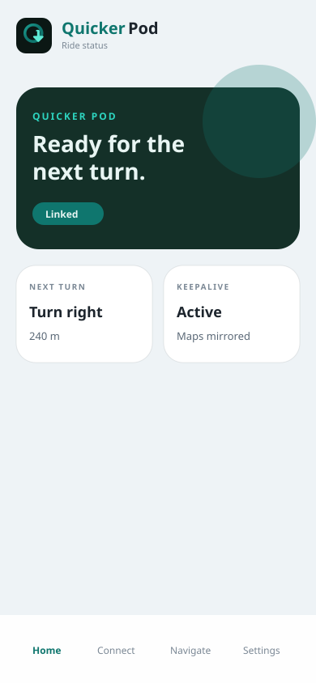

<p align="center">
  
</p>

<h1 align="center">Quicker-pod</h1>

<p align="center">
  <strong>Free &amp; open-source Tripper Pod companion</strong><br />
  Download the Android APK for full BLE pairing, or explore the protocol lab on the web.
</p>

<p align="center">
  <a href="https://praneth2580.github.io/Quicker-pod/"><strong>Landing page</strong></a>
  ·
  <a href="https://github.com/praneth2580/Quicker-pod/releases/latest"><strong>Download APK</strong></a>
  ·
  <a href="https://github.com/praneth2580/Quicker-pod">GitHub</a>
</p>

<p align="center">
  <a href="https://praneth2580.github.io/Quicker-pod/">
    
  </a>
</p>

> **Two surfaces, one repo:** [GitHub Pages](https://praneth2580.github.io/Quicker-pod/) is the **landing / SEO / Download APK** site. The **Android APK** is the functional companion (pairing, Maps mirroring, navigate). Prefer the APK for real Tripper use — browsers cannot host the phone GATT server.

**Quicker-pod** is an open-source navigation companion for the Royal Enfield **Tripper Pod**.

For setup, development, build, and deployment instructions, see **[DEVELOPMENT.md](./DEVELOPMENT.md)**.

---

## Download the APK

1. Open the [landing page](https://praneth2580.github.io/Quicker-pod/) and tap **Download APK**, or go to [latest release](https://github.com/praneth2580/Quicker-pod/releases/latest).
2. Install `quicker-pod.apk` (enable install from that source on Android).
3. Open **Quicker Pod** and connect your Tripper.

**Stable download URL** (once a release with that asset exists):

```text
https://github.com/praneth2580/Quicker-pod/releases/latest/download/quicker-pod.apk
```

The landing page also calls the GitHub Releases API (`/repos/praneth2580/Quicker-pod/releases/latest`) and links the APK asset when present.

### Cut a new APK release

```bash
export GITHUB_TOKEN=…   # repo scope; or: gh auth login
# clean working tree, then:
npm run deploy:app      # asks major|minor → APK Release → update landing URL → deploy:web
```

See **[DEVELOPMENT.md](./DEVELOPMENT.md)** for `DRY_RUN` and JDK 21 notes.

Tag-only alternative: push a `v*` tag (or Actions → **Release APK**) — CI uploads `quicker-pod.apk` and refreshes download metadata on `gh-pages`.

---

## What you can do

| Area | What it does |
|------|----------------|
| **Landing (GitHub Pages)** | Product story, SEO, Download APK — no in-app chrome |
| **Android APK** | Full companion: pairing, Maps → Tripper, Navigate / Connect / Settings |

---

## How to use Quicker-pod

### Android (recommended for pairing)

1. Install the latest APK from GitHub Releases
2. Connect to your Tripper and complete the PIN shown on the display
3. Use the in-app dashboard and Protocol Lab

See [docs/capacitor-tripper-ble.md](./docs/capacitor-tripper-ble.md) for native BLE details.

### Landing site

```bash
npm run dev:web      # http://localhost:5173 — landing only
npm run build:web
npm run deploy:web   # build dist-site/ → gh-pages
```

### App (local web preview of the companion UI)

```bash
npm run dev:app      # open /app.html — Connect / Navigate / Settings
npm run build:app    # plugins + Vite + cap sync android
npm run deploy:app   # major/minor bump → APK → landing URL → deploy:web
```

> **Full Tripper pairing (PIN on pod + AUTH)** needs the phone GATT server role — use the **Android APK**, not Web Bluetooth alone.

---

## App navigation

| Screen | Route | Notes |
|--------|-------|-------|
| Home (entry) | `/` → `/dashboard` | Ride status, next turn, connection summary |
| Navigate | `/navigate` | Maps mirror + keepalive + manual guidance |
| Connect | `/connect` | Tripper pairing / reconnect |
| Settings | `/settings` | Appearance, Maps notification access, developer tools |
| Dev hub | `/dev` | Protocol Lab / Fuzzer / BLE Debug (via Settings, not bottom nav) |

Legacy routes (`/explorer`, `/console`, `/transmit`, `/simulator`) redirect to Protocol Lab tabs. App routes exist only in the Capacitor/`dev:app` bundle — not on GitHub Pages.

**Maps → Tripper:** on Android, enable notification access and start Google Maps navigation. See [`docs/maps-notification-mirroring.md`](./docs/maps-notification-mirroring.md).

---

## Browser / platform requirements

| Feature | Android APK | Chrome (Android/Desktop) | Firefox / Safari |
|---------|-------------|--------------------------|------------------|
| Full Tripper pairing (GATT server) | ✅ | ❌ | ❌ |
| Web Bluetooth client | — | ✅ | ❌ |
| Landing / APK download (GitHub Pages) | ✅ (site) | ✅ | ✅ |

---

## Safety notes

- Mutation / fuzzer tools require explicit user action
- Navigate **keepalive** (opt-in) re-sends the last nav packet every 1s while connected — matching the official companion
- Mutation tools are disabled until a writable characteristic is selected
- Mutations stop on disconnect or error

---

## Roadmap

- [x] Reverse-engineered Tripper Pod protocol — see [`tripper-protocol/re-engineered-protocol/`](./tripper-protocol/re-engineered-protocol/)
- [ ] OpenStreetMap integration
- [ ] GPX import
- [x] Manual Tripper nav write path (idle / guidance / keepalive)
- [x] Android notification / Maps nav mirroring (NotificationListenerService)
- [ ] Turn-by-turn navigation (OSM / GPX)
- [ ] Ride recording and route history
- [ ] Offline maps
- [ ] Fuel tracking

---

## Contributing

This project is in early development. Issues, protocol findings, and pull requests are welcome — especially packet captures and UUID mappings from real Tripper Pod hardware.

See **[DEVELOPMENT.md](./DEVELOPMENT.md)** for how to run and build the project locally.

---

## License

Open source. See repository for license details.
