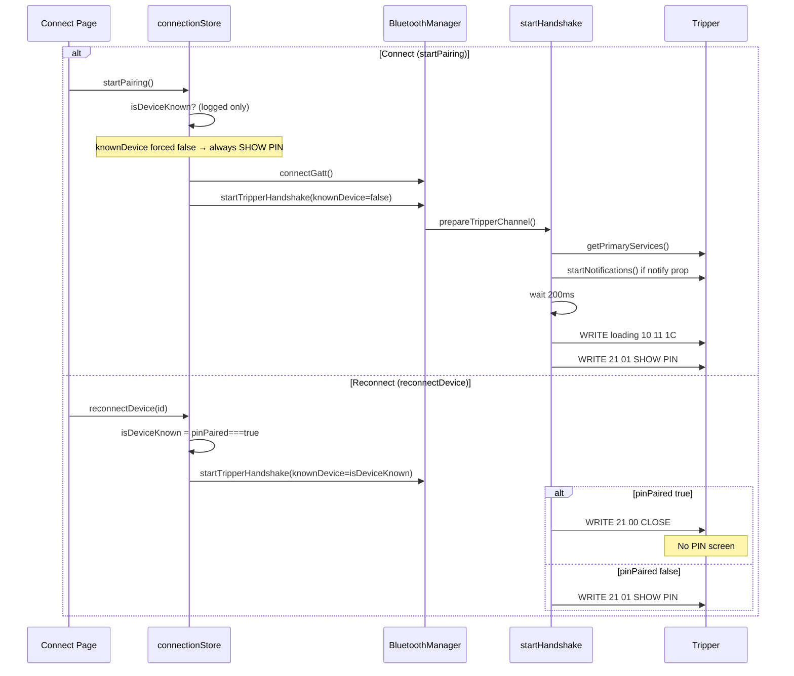

# Tripper BLE Startup Handshake (verified 2026-06-24)

Sources: `TripperBleManager.smali`, `TripperBleManager$gattCallback$1.smali`,
`TripperBleManager$serverCallback$1.smali`, `TripperProtocol.smali`, and
`logcat_2026-06-24_20-09-00.txt` (official Royal Enfield `reprime` app).

## Architecture: dual GATT roles

The phone acts as **both** a GATT **client** (writes commands to the Tripper) and a
GATT **peripheral/server** (receives Tripper responses). This is not optional.

| Role | UUID | Purpose |
|------|------|---------|
| Client → Tripper char | `01FF0101-BA5E-F4EE-5CA1-EB1E5E4B1CE0` | Send 20-byte command frames |
| Server ← Tripper writes | Same service/char hosted on phone | Receive AUTH, OS_VERSION, SERIAL, SESSION |

Tripper responses arrive via `onCharacteristicWriteRequest` on the phone's GATT server,
**not** via client-side notifications. Web Bluetooth cannot implement the server role.

On the Tripper device, the command characteristic is **write-only** (`props=0x04`,
`WRITE_NO_RESPONSE`). There is often **no CCCD** on the Tripper side.

## `connectDevice()` sequence

1. Clear `userDisconnected`, `hadConnection`
2. Cancel service auto-shutdown timer
3. Remove pending reconnect callbacks
4. Store `currentDeviceMac`, seed `lastNavPacket` = `PKT_NAV_IDLE`
5. `cleanup()` — disconnect prior GATT, clear queues
6. **`startGattServer()`** — open peripheral with service `01FF0100…` and char `01FF0101…`
7. **Wait 200 ms**
8. `connectGatt(context, autoConnect=false, callback, TRANSPORT_LE)`

## `onConnectionStateChange` (CONNECTED)

1. Reset reconnect counter, set `hadConnection=true`
2. Save `lastConnectedMac` to prefs
3. If locked → `sendLocked()`, else **`sendLoadingScreen()`** (`10 11 1C …`)
4. Fire `onConnected` callback
5. `discoverServices()`

## `onServicesDiscovered`

1. Iterate services; find `01FF0100…` / `01FF0101…`
2. Store write characteristic reference
3. `setCharacteristicNotification(char, true)`
4. If CCCD exists → write `ENABLE_NOTIFICATION_VALUE` (`01 00`); else skip
5. **Wait 200 ms** (Handler) → `startHandshake()`
6. `onDescriptorWrite` only logs — it does **not** trigger the handshake

## `startHandshake()`

Branch on `isDeviceKnown(currentMac)`:

### New device (PIN pairing)

| Step | Delay after prior | Packet | Label |
|------|-------------------|--------|-------|
| 1 | — | `21 01 … 50 A7` | SHOW PIN (`PKT_PIN_SHOW`) |
| 2 | 300 ms | — | `onReadyForPin()` — UI shows PIN entry |

No SESSION packet is sent before SHOW PIN. No response is waited for.

### Known device (reconnect)

| Step | Delay | Packet | Label |
|------|-------|--------|-------|
| 1 | — | `21 00 … 40 45` | CLOSE / RESUME |
| 2 | 200 ms | `50 [h][m][fmt] …` | SET TIME (current clock) |
| 3 | 150 ms | `03 … 45 D9` ×2 | PING FW (sent twice) |
| 4 | 300 ms | — | `onAlreadyPaired()` |

## Post-PIN (`submitPin` in MainActivity)

| Delay | Action |
|-------|--------|
| 0 | `sendPin(code)` → `20 [6×ASCII] … CRC` |
| 150 ms | `sendVersion()` → SET TIME |
| 300 ms | `sendPingFirmware()` |
| 500 ms | `sendPingWaypoint()` |
| 600 ms | `sendPingWaypoint()` (again) |
| 5000 ms | `markDeviceAsKnown(mac)` if still on PIN screen |

AUTH is handled when Tripper writes `20 01 …` to the phone GATT server.

## Write discipline

- All writes use **`WRITE_TYPE_NO_RESPONSE`** (`setWriteType(1)`)
- Single-packet queue with `onCharacteristicWrite` → `pumpQueue()`
- 80 ms write-timeout fallback if `onCharacteristicWrite` never fires

## Logcat timeline (official RE app, new device)

Base: `2026-06-24 20:08:30.402` = connect()

| T+ | Event |
|----|-------|
| −1.65 s | GATT server `addService(01FF0100…)` |
| 0.000 s | `connect()` to Tripper |
| 0.167 s | GATT server + client CONNECTED |
| 0.200 s | `discoverServices()` |
| 0.887 s | `onSearchComplete` / services discovered |
| 0.887 s | `setCharacteristicNotification(01FF0101, true)` — descriptor null |
| 0.892 s | **TX SHOW PIN** `21 01 …` |
| 5.905 s | **TX PIN** `20 36 35 39 32 32 36 …` ("659226") |
| 5.927 s | **RX AUTH** via GATT server `onCharacteristicWriteRequest` (0x01) |
| 5.927 s | **TX SET TIME** |
| 5.931 s | **TX PING FW** ×2 |
| 6.144 s | **TX PING WP** ×2 |
| 6.148 s | **RX OS_VERSION** `12.10` via GATT server |

## Pairing flow (Quicker-pod) — decision points

### Condition that prevents SHOW PIN

| Scenario | `isDeviceKnown` | Packet sent | PIN on pod? |
|----------|-----------------|-------------|-------------|
| Connect button (`startPairing`) | ignored (forced `false`) | `0x21 01` | Should show |
| Reconnect + `pinPaired: true` | `true` | `0x21 00` | **Will not show** |
| Reconnect + `pinPaired: false` | `false` | `0x21 01` | Should show |
| Packet never reaches pod | any | — | **Will not show** |

Persistence: `localStorage` key `quicker-pod-connection` → `knownDevices[].pinPaired`.
Set `true` only in `finalizeConnection()` after successful PIN submit.

### Debug logging

Enable **Settings → Debug mode**, then filter console for `[TripperHandshake]`.
Branch decisions log even when debug mode is off.

| Issue | Severity | Detail |
|-------|----------|--------|
| **No GATT server** | Critical | Tripper expects phone peripheral; Web Bluetooth cannot host one |
| **Wrong write type** | High | Must use `writeWithoutResponse`; char is props=0x04 only — **fixed in Quicker-pod `session.ts`** |
| **Missing 200 ms pre-handshake delay** | Medium | **fixed in `prepareTripperChannel()`** |
| **Reconnect without handshake** | High | **fixed in `connectionStore.reconnectDevice()`** |
| **Awaiting client notifications for AUTH** | Medium | AUTH arrives on GATT server in official app — `waitForAuthResponse` skips when no notify |
